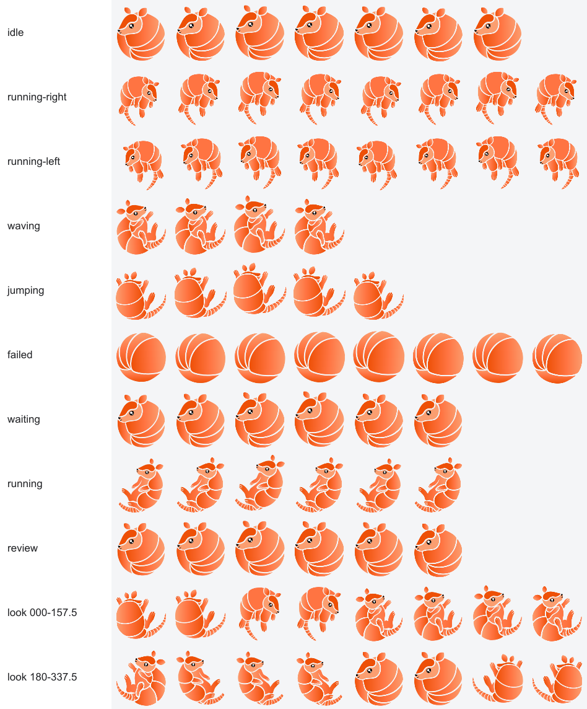

# Kairos Codex Pet

An animated Codex pet built from the six armadillo mascot illustrations in the [Kairos community repository](https://github.com/kairos-io/community/tree/main/artwork/mascot/SVG).

<p align="center">
  
</p>

## Install

The ready-to-use Codex v2 package is in `dist/kairos-armadillo`.

```sh
mkdir -p ~/.codex/pets
cp -R dist/kairos-armadillo ~/.codex/pets/
```

Then open **Settings > Pets**, select **Refresh**, choose **Kairos Armadillo**, and select **Wake Pet**.

For the legacy/web upload flow, upload `dist/kairos-armadillo-upload.png` from the Pets settings page.

## Preview


The generated atlas includes idle, look, jump, click, drag, and active animation states:



## Build

Requires Node.js 20 or newer.

```sh
npm install
npm run build
```

The build script renders the SVG artwork into transparent sprite cells, assembles both atlas versions, validates dimensions and required frames, checks unused cells and hidden RGB data, and writes everything to `dist/`.

## Outputs

- `dist/kairos-armadillo/`: installable Codex v2 package.
- `dist/kairos-armadillo-v2.png`: standalone 1536 x 2288 v2 atlas.
- `dist/kairos-armadillo-upload.png`: 1536 x 1872 upload-compatible atlas.
- `dist/kairos-armadillo-preview.png`: labeled preview of animation states.
- `docs/kairos-armadillo-demo.gif`: compact in-app animation demo.
- `docs/kairos-armadillo-screenshot.png`: static in-app preview.

## Artwork

The build preserves the supplied Kairos artwork and uses deterministic resizing, positioning, mirroring, and slight rotation to create animation frames. No replacement character artwork is generated.

The sixteen look-direction cells use the closest available front, side, and back poses from the six source illustrations. See [SOURCES.md](SOURCES.md) for source links and the modification notice.

Licensed under the Apache License 2.0. See [LICENSE](LICENSE).
